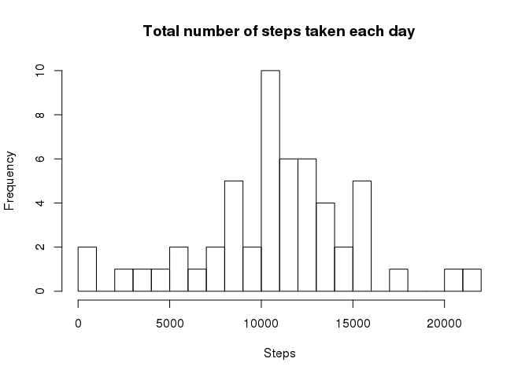
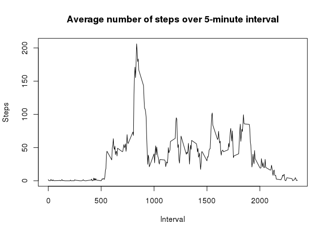
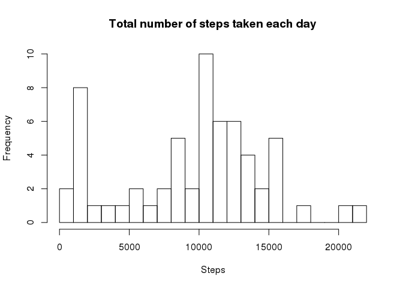
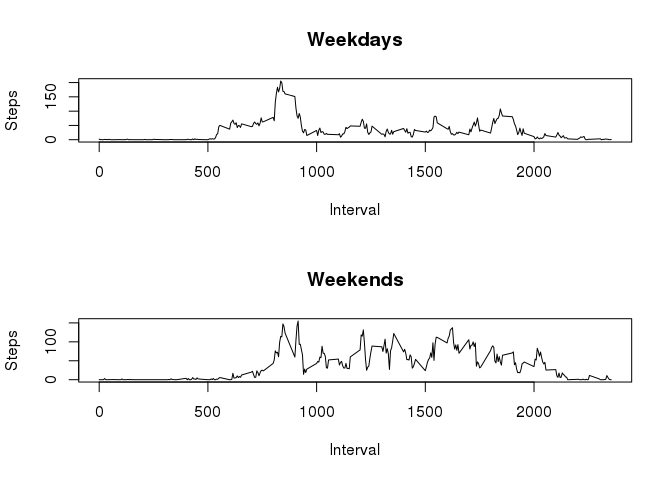

# Reproducible Research: Peer Assessment 1


### Loading and preprocessing the data

I assume that the file `activity.cgesv` is placed in the same folder as this file (`PA1_template.Rmd`).


```r
data <- read.csv("activity.csv")
data$date <- as.Date(data$date , format = "%Y-%m-%d")
```

### What is mean total number of steps taken per day?

Total number of steps per day:


```r
steps.per.day <- aggregate(data$steps, by = list(data$date), sum)
colnames(steps.per.day) <- c("Date", "Steps")
summary(steps.per.day)
```

```
##       Date                Steps      
##  Min.   :2012-10-01   Min.   :   41  
##  1st Qu.:2012-10-16   1st Qu.: 8841  
##  Median :2012-10-31   Median :10765  
##  Mean   :2012-10-31   Mean   :10766  
##  3rd Qu.:2012-11-15   3rd Qu.:13294  
##  Max.   :2012-11-30   Max.   :21194  
##                       NA's   :8
```


```r
hist(steps.per.day$Steps, breaks = 20, main = "Total number of steps taken each day", xlab = "Steps")
```

 

Mean number of steps taken per day (over the days for which data is present):


```r
mean(steps.per.day$Steps, na.rm = TRUE)
```

```
## [1] 10766.19
```

Median number of steps taken per day (over the days for which data is present):


```r
median(steps.per.day$Steps, na.rm = TRUE)
```

```
## [1] 10765
```


### What is the average daily activity pattern?

Time series plot of average number of steps taken over each 5-minute interval, averaged across all days


```r
steps.per.interval <- aggregate(data$steps, by = list(data$interval), mean, na.rm = TRUE)
colnames(steps.per.interval) <- c("Interval", "Steps")
plot(steps.per.interval$Interval, steps.per.interval$Steps, type="l", main = "Average number of steps over 5-minute interval", 
     xlab = "Interval", ylab = "Steps")
```

 

The 5-minute interval that contains the maximum number of steps (on average across all days) is:


```r
steps.per.interval[which.max(steps.per.interval$Steps), ]
```

```
##     Interval    Steps
## 104      835 206.1698
```

### Imputing missing values

Total number of missing values in the dataset:


```r
sum(is.na(data$steps))
```

```
## [1] 2304
```

To fill the missing values, I'll use the median for that 5-minute interval based on data from the rest of the days. The dataset equal to the original but with the missing data filled in is:


```r
median.steps.per.interval <- aggregate(data$steps, by = list(data$interval), median, na.rm = TRUE)
colnames(median.steps.per.interval) <- c("interval", "median.steps")

imputed.data <- merge(data, median.steps.per.interval, sort = FALSE)
missing <- is.na(imputed.data$steps)
imputed.data$steps[missing] <- imputed.data$median.steps[missing]
imputed.data$median.steps <- NULL
```

To compare resulting dataset to the original one, we repeat the steps done in the first part of the assignment: build a histogram of number of steps per day...


```r
imputed.steps.per.day <- aggregate(imputed.data$steps, by = list(imputed.data$date), sum)
colnames(imputed.steps.per.day) <- c("Date", "Steps")
hist(imputed.steps.per.day$Steps, breaks = 20, main = "Total number of steps taken each day", xlab = "Steps")
```

 

...and calculate mean and median values for them:


```r
mean(imputed.steps.per.day$Steps)
```

```
## [1] 9503.869
```

```r
median(imputed.steps.per.day$Steps)
```

```
## [1] 10395
```

Both mean and median are lower than for data set with missing values, because imputed values are mostly smaller than average (second bucket of the histogram).

### Are there differences in activity patterns between weekdays and weekends?

Add a new factor to the dataset with "weekday" and "weekend" levels.


```r
week.data <- imputed.data
week.data$weekday <- factor(weekdays(week.data$date) %in% c("Saturday", "Sunday"), levels = c(FALSE, TRUE), labels = c("weekday", "weekend"))
summary(week.data)
```

```
##     interval          steps          date               weekday     
##  Min.   :   0.0   Min.   :  0   Min.   :2012-10-01   weekday:12960  
##  1st Qu.: 588.8   1st Qu.:  0   1st Qu.:2012-10-16   weekend: 4608  
##  Median :1177.5   Median :  0   Median :2012-10-31                  
##  Mean   :1177.5   Mean   : 33   Mean   :2012-10-31                  
##  3rd Qu.:1766.2   3rd Qu.:  8   3rd Qu.:2012-11-15                  
##  Max.   :2355.0   Max.   :806   Max.   :2012-11-30
```

Time series plot of average number of steps taken over each 5-minute interval, averaged across all weekdays and all weekends separately:


```r
avg.steps <- aggregate(week.data$steps, by = list(week.data$interval, week.data$weekday), mean)
colnames(avg.steps) <- c("Interval", "Day", "Steps")

par(mfrow = c(2, 1))
plot(avg.steps[avg.steps$Day == "weekday", 1], avg.steps[avg.steps$Day == "weekday", 3], 
     type="l", main = "Weekdays", 
     xlab = "Interval", ylab = "Steps")
plot(avg.steps[avg.steps$Day == "weekend", 1], avg.steps[avg.steps$Day == "weekend", 3], 
     type="l", main = "Weekends", 
     xlab = "Interval", ylab = "Steps")
```

 

We can see that on the weekends the movement starts later and ends later.
